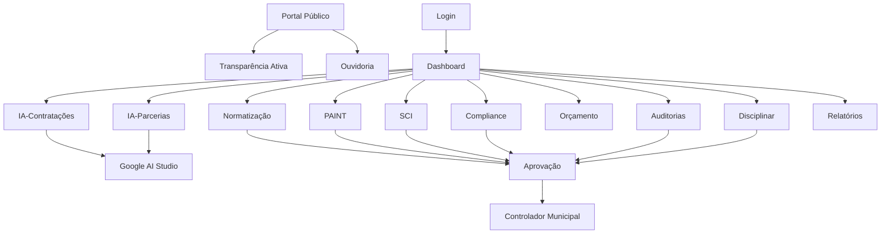

## 1. Visão Geral do Produto

O Sistema de Controladoria Municipal (SCM) com IA integrada é uma plataforma digital desenvolvida para atender aos requisitos da Lei 040/2025, que estabelece as competências da Controladoria Municipal. O sistema utiliza inteligência artificial para otimizar análises de contratações, parcerias e monitoramento orçamentário, garantindo transparência, eficiência e conformidade legal na gestão municipal.

O produto visa resolver problemas de gestão pública através de automação inteligente, análise preditiva e monitoramento em tempo real, beneficiando servidores municipais, gestores públicos e cidadãos com acesso transparente às informações governamentais.

## 2. Funcionalidades Principais

### 2.1 Papéis de Usuário

| Papel | Método de Registro | Permissões Principais |
|------|---------------------|------------------|
| Cidadão | Cadastro público com CPF | Acesso à transparência ativa, ouvidoria, relatórios públicos |
| Servidor Municipal | Cadastro com matrícula institucional | Acesso aos módulos de acordo com o nível de acesso definido |
| Analista de Controladoria | Indicação e aprovação por superior | Acesso completo aos módulos de análise e auditoria |
| Controlador Municipal | Nomeação legal | Acesso total e administrativo ao sistema |
| Auditor | Credenciamento específico | Acesso aos módulos de auditoria e compliance |

### 2.2 Módulos de Funcionalidades

O SCM contempla os seguintes módulos principais:

1. **Dashboard Principal**: visão geral dos indicadores, alertas e ações pendentes
2. **Módulo de Normatização**: gestão de normas, regulamentos e procedimentos
3. **Planejamento Anual (PAINT)**: elaboração e acompanhamento do planejamento institucional
4. **Gestão da Carreira (SCI)**: administração do Sistema de Carreira da Controladoria
5. **Integridade e Compliance**: controles internos e verificações de conformidade
6. **Análise de Contratações com IA**: análise preditiva e detecção de riscos em contratos
7. **Análise de Parcerias com IA**: avaliação de parcerias público-privadas e convênios
8. **Monitoramento Orçamentário**: acompanhamento da execução orçamentária em tempo real
9. **Auditorias**: planejamento, execução e acompanhamento de auditorias
10. **Processos Disciplinares**: gestão de processos administrativos disciplinares
11. **Ouvidoria**: canal de atendimento ao cidadão
12. **Transparência Ativa**: publicação obrigatória de informações públicas
13. **Relatórios Consolidados**: geração de relatórios gerenciais e estatísticos

### 2.3 Detalhamento das Funcionalidades por Página

| Nome da Página | Módulo | Descrição das Funcionalidades |
|-----------|-------------|---------------------|
| Dashboard Principal | Dashboard | Exibir indicadores em tempo real, alertas de riscos, pendências por módulo, gráficos de performance, acesso rápido aos módulos principais |
| Normatização | Normatização | Listar normas vigentes, cadastrar nova norma, editar normas existentes, controlar versões, definir vigência, anexar documentos, busca avançada por palavras-chave |
| PAINT | Planejamento Anual | Criar planejamento anual, definir metas e objetivos, alocar recursos, acompanhar execução, gerar relatórios de progresso, aprovar etapas do planejamento |
| SCI | Gestão da Carreira | Gerenciar perfis de cargos, controlar progressão funcional, administrar capacitações, avaliar desempenho, gerar histórico funcional, definir requisitos de promoção |
| Compliance | Integridade | Realizar check-lists de conformidade, registrar não-conformidades, definir planos de ação, monitorar prazos, gerar relatórios de compliance, exportar evidências |
| Análise de Contratações | IA-Contratações | Importar contratos para análise, detectar riscos automáticamente, gerar pareceres técnicos, comparar valores de mercado, identificar sobrepreço, sugerir impugnações |
| Análise de Parcerias | IA-Parcerias | Avaliar parcerias propostas, verificar idoneidade de parceiros, analisar riscos contratuais, simular cenários econômicos, gerar recomendações, acompanhar execução |
| Monitoramento Orçamentário | Orçamento | Visualizar execução orçamentária, comparar planejado vs executado, emitir alertas de desvio, gerar projeções, exportar dados para Excel, criar dashboards personalizados |
| Auditorias | Auditoria | Planejar auditorias, designar equipes, executar trabalhos de campo, registrar achados, elaborar relatórios, acompanhar implementação de recomendações, calcular custo-benefício |
| Processos Disciplinares | Disciplinar | Abrir processos, notificar envolvidos, controlar prazos legais, registrar diligências, proferir decisões, gerar autos físicos, acompanhar recursos |
| Ouvidoria | Ouvidoria | Registrar manifestações, classificar por tipo, encaminhar para unidade responsável, controlar prazos de resposta, responder ao cidadão, gerar estatísticas de atendimento |
| Transparência | Transparência | Publicar dados obrigatórios, manter histórico de publicações, responder pedidos de acesso à informação, gerar relatórios de transparência, manter canal de dados abertos |
| Relatórios | Relatórios | Gerar relatórios gerenciais, criar dashboards personalizados, exportar dados estatísticos, agendar envio de relatórios, consolidar informações por período, comparar indicadores |
| Login | Autenticação | Realizar login com CPF e senha, recuperação de senha, autenticação de dois fatores, logout seguro, registro de tentativas de acesso |
| Cadastro | Autenticação | Cadastrar novo usuário, validar CPF, verificar email, definir perfil de acesso, aprovação por administrador, envio de documentação comprobatória |

## 3. Fluxos de Trabalho Principais

### 3.1 Fluxo do Cidadão
O cidadão acessa o portal de transparência, visualiza informações públicas, registra manifestações na ouvidoria e acompanha o status de suas solicitações.

### 3.2 Fluxo do Servidor Municipal
O servidor realiza login, acessa os módulos conforme seu perfil, executa atividades de sua competência e gera relatórios de suas ações.

### 3.3 Fluxo do Analista de Controladoria
O analista recebe demandas, utiliza IA para análises complexas, elabora pareceres técnicos, submete para aprovação e acompanha implementação.

### 3.4 Fluxo do Controlador Municipal
O controlador aprova ações críticas, define políticas institucionais, monitora indicadores estratégicos, gere relatórios para órgãos superiores e representa a instituição.

## 4. Interface do Usuário

### 4.1 Estilo de Design
- **Cores Primárias**: Azul institucional (#1E3A8A) e branco (#FFFFFF)
- **Cores Secundárias**: Verde sucesso (#10B981), vermelho alerta (#EF4444), amarelo aviso (#F59E0B)
- **Estilo de Botões**: Arredondados com sombra suave, hover effects sutis
- **Fontes**: Inter para textos principais, Roboto Mono para dados tabulares
- **Tamanhos de Fonte**: 16px para corpo, 14px para legendas, 24px para títulos
- **Layout**: Baseado em cards com grid responsivo, navegação lateral colapsável
- **Ícones**: Estilo outline consistente, preferencialmente da biblioteca Heroicons

### 4.2 Visão Geral das Páginas

| Página | Módulo | Elementos de Interface |
|-----------|-------------|-------------|
| Dashboard | Principal | Cards de indicadores com gráficos circulares, tabela de alertas coloridos, gráfico de linhas para tendências, menu lateral com ícones |
| Normatização | Normas | Tabela sortável com paginação, barra de busca com filtros, modal para cadastro, upload drag-and-drop para anexos |
| PAINT | Planejamento | Timeline visual para etapas, formulário multi-step, gráfico de Gantt para cronograma, dashboard com KPIs |
| Análise IA | Inteligência Artificial | Interface drag-and-drop para upload de documentos, barra de progresso durante análise, cards de riscos detectados, visualização de similaridades |
| Transparência | Público | Cards de acesso rápido, lista de documentos com ícones de tipo, busca por período, download direto |

### 4.3 Responsividade
O sistema é desenvolvido com abordagem desktop-first, adaptando-se a tablets e smartphones. Otimizado para touch em dispositivos móveis com botões de ação flutuantes e navegação por gestos. Layout colapsa para menu hambúrguer em telas menores que 768px.