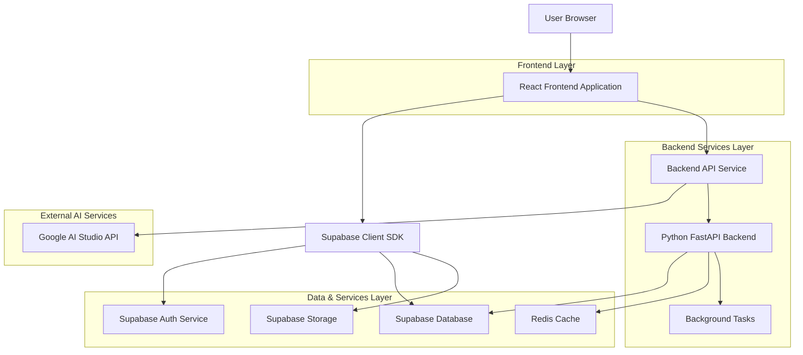
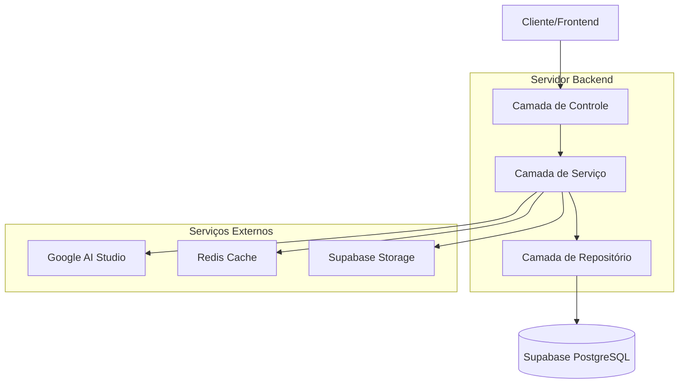
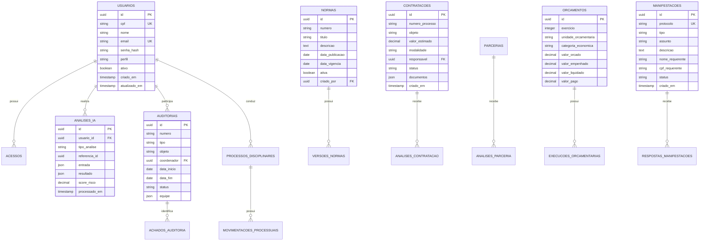

## 1. Arquitetura do Sistema



## 2. Descrição das Tecnologias

- **Frontend**: React@18 + TypeScript + Tailwind CSS + Vite
- **Backend**: Python FastAPI + SQLAlchemy + Pydantic
- **Banco de Dados**: Supabase (PostgreSQL)
- **Autenticação**: Supabase Auth com JWT
- **Armazenamento**: Supabase Storage para documentos
- **Cache**: Redis para processamento de IA
- **IA/ML**: Google AI Studio API (Gemini Pro)
- **Background Tasks**: Celery + Redis
- **Monitoramento**: Sentry para erro tracking
- **Documentação**: Swagger/OpenAPI

## 3. Definições de Rotas

| Rota | Propósito |
|-------|---------|
| / | Dashboard principal com visão geral do sistema |
| /login | Página de autenticação de usuários |
| /dashboard | Dashboard personalizado por perfil de usuário |
| /normatizacao | Gestão de normas e regulamentos |
| /paint | Planejamento Anual (PAINT) |
| /sci | Sistema de Carreira (SCI) |
| /compliance | Módulo de integridade e compliance |
| /contratacoes-ia | Análise de contratações com IA |
| /parcerias-ia | Análise de parcerias com IA |
| /orcamento | Monitoramento orçamentário |
| /auditorias | Gestão de auditorias |
| /processos-disciplinares | Processos administrativos disciplinares |
| /ouvidoria | Atendimento ao cidadão |
| /transparencia | Portal de transparência ativa |
| /relatorios | Geração de relatórios consolidados |
| /perfil | Configurações de perfil do usuário |
| /admin | Painel administrativo do sistema |

## 4. Definições de APIs

### 4.1 Autenticação

```
POST /api/auth/login
```

Request:
| Parametro | Tipo | Obrigatório | Descrição |
|-----------|-------------|-------------|-------------|
| cpf | string | true | CPF do usuário (11 dígitos) |
| senha | string | true | Senha do usuário |
| lembrar | boolean | false | Manter sessão ativa |

Response:
| Parametro | Tipo | Descrição |
|-----------|-------------|-------------|
| token | string | JWT token para autenticação |
| refresh_token | string | Token para renovação de sessão |
| usuario | object | Dados do usuário autenticado |
| permissoes | array | Lista de permissões do usuário |

### 4.2 Análise de Contratações com IA

```
POST /api/ia/analisar-contratacao
```

Request:
| Parametro | Tipo | Obrigatório | Descrição |
|-----------|-------------|-------------|-------------|
| contrato_id | uuid | true | ID do contrato no banco |
| documentos | array | true | Array de URLs dos documentos |
| contexto_adicional | object | false | Informações adicionais para análise |

Response:
| Parametro | Tipo | Descrição |
|-----------|-------------|-------------|
| analise_id | uuid | ID único da análise |
| riscos_detectados | array | Lista de riscos identificados |
| score_risco | number | Score de 0-100 do risco geral |
| recomendacoes | array | Sugestões de ação |
| tempo_processamento | number | Tempo de processamento em segundos |

### 4.3 Monitoramento Orçamentário

```
GET /api/orcamento/execucao/{exercicio}
```

Request Parameters:
| Parametro | Tipo | Obrigatório | Descrição |
|-----------|-------------|-------------|-------------|
| exercicio | integer | true | Ano do exercício orçamentário |
| unidade | string | false | Código da unidade orçamentária |
| categoria | string | false | Categoria econômica |

Response:
| Parametro | Tipo | Descrição |
|-----------|-------------|-------------|
| orcado | number | Valor orçado |
| empenhado | number | Valor empenhado |
| liquidado | number | Valor liquidado |
| pago | number | Valor pago |
| percentual_execucao | number | Percentual de execução |
| alertas | array | Lista de alertas gerados |

## 5. Arquitetura do Servidor



## 6. Modelo de Dados

### 6.1 Definição do Modelo de Dados



### 6.2 Linguagem de Definição de Dados (DDL)

```sql
-- Tabela de Usuários
CREATE TABLE usuarios (
  id UUID PRIMARY KEY DEFAULT gen_random_uuid(),
  cpf VARCHAR(11) UNIQUE NOT NULL,
  nome VARCHAR(255) NOT NULL,
  email VARCHAR(255) UNIQUE NOT NULL,
  senha_hash VARCHAR(255) NOT NULL,
  perfil VARCHAR(50) NOT NULL CHECK (perfil IN ('cidadao', 'servidor', 'analista', 'controlador', 'auditor')),
  ativo BOOLEAN DEFAULT true,
  criado_em TIMESTAMP WITH TIME ZONE DEFAULT NOW(),
  atualizado_em TIMESTAMP WITH TIME ZONE DEFAULT NOW()
);

-- Índices para usuários
CREATE INDEX idx_usuarios_cpf ON usuarios(cpf);
CREATE INDEX idx_usuarios_perfil ON usuarios(perfil);
CREATE INDEX idx_usuarios_ativo ON usuarios(ativo);

-- Tabela de Contratações
CREATE TABLE contratacoes (
  id UUID PRIMARY KEY DEFAULT gen_random_uuid(),
  numero_processo VARCHAR(50) UNIQUE NOT NULL,
  objeto TEXT NOT NULL,
  valor_estimado DECIMAL(15,2) NOT NULL,
  modalidade VARCHAR(100) NOT NULL,
  responsavel UUID REFERENCES usuarios(id),
  status VARCHAR(50) NOT NULL DEFAULT 'em_analise',
  documentos JSONB,
  criado_em TIMESTAMP WITH TIME ZONE DEFAULT NOW(),
  atualizado_em TIMESTAMP WITH TIME ZONE DEFAULT NOW()
);

-- Tabela de Análises IA
CREATE TABLE analises_ia (
  id UUID PRIMARY KEY DEFAULT gen_random_uuid(),
  usuario_id UUID REFERENCES usuarios(id) NOT NULL,
  tipo_analise VARCHAR(50) NOT NULL CHECK (tipo_analise IN ('contratacao', 'parceria', 'orcamento')),
  referencia_id UUID NOT NULL,
  entrada JSONB NOT NULL,
  resultado JSONB,
  score_risco DECIMAL(5,2),
  tempo_processamento INTEGER,
  processado_em TIMESTAMP WITH TIME ZONE DEFAULT NOW()
);

-- Tabela de Auditorias
CREATE TABLE auditorias (
  id UUID PRIMARY KEY DEFAULT gen_random_uuid(),
  numero VARCHAR(50) UNIQUE NOT NULL,
  tipo VARCHAR(100) NOT NULL,
  objeto TEXT NOT NULL,
  coordenador UUID REFERENCES usuarios(id),
  data_inicio DATE NOT NULL,
  data_fim DATE,
  status VARCHAR(50) NOT NULL DEFAULT 'planejada',
  equipe JSONB,
  criado_em TIMESTAMP WITH TIME ZONE DEFAULT NOW(),
  atualizado_em TIMESTAMP WITH TIME ZONE DEFAULT NOW()
);

-- Tabela de Manifestações (Ouvidoria)
CREATE TABLE manifestacoes (
  id UUID PRIMARY KEY DEFAULT gen_random_uuid(),
  protocolo VARCHAR(20) UNIQUE NOT NULL,
  tipo VARCHAR(50) NOT NULL CHECK (tipo IN ('sugestao', 'reclamacao', 'denuncia', 'elogio', 'solicitacao')),
  assunto VARCHAR(255) NOT NULL,
  descricao TEXT NOT NULL,
  nome_requerente VARCHAR(255) NOT NULL,
  cpf_requerente VARCHAR(11),
  email_requerente VARCHAR(255),
  telefone_requerente VARCHAR(20),
  status VARCHAR(50) NOT NULL DEFAULT 'registrada',
  unidade_destino UUID,
  responsavel UUID REFERENCES usuarios(id),
  criado_em TIMESTAMP WITH TIME ZONE DEFAULT NOW(),
  atualizado_em TIMESTAMP WITH TIME ZONE DEFAULT NOW()
);

-- Índices para performance
CREATE INDEX idx_analises_ia_tipo ON analises_ia(tipo_analise);
CREATE INDEX idx_analises_ia_referencia ON analises_ia(referencia_id);
CREATE INDEX idx_analises_ia_processado ON analises_ia(processado_em DESC);
CREATE INDEX idx_contratacoes_status ON contratacoes(status);
CREATE INDEX idx_contratacoes_modalidade ON contratacoes(modalidade);
CREATE INDEX idx_manifestacoes_protocolo ON manifestacoes(protocolo);
CREATE INDEX idx_manifestacoes_status ON manifestacoes(status);
CREATE INDEX idx_manifestacoes_criado ON manifestacoes(criado_em DESC);

-- Permissões básicas para acesso anônimo (transparência)
GRANT SELECT ON manifestacoes TO anon;
GRANT SELECT ON usuarios(id, nome, perfil) TO anon;

-- Permissões completas para usuários autenticados
GRANT ALL PRIVILEGES ON ALL TABLES TO authenticated;
GRANT ALL PRIVILEGES ON ALL SEQUENCES TO authenticated;

-- Dados iniciais
INSERT INTO usuarios (cpf, nome, email, senha_hash, perfil) VALUES
('00000000000', 'Administrador do Sistema', 'admin@controladoria.municipio.gov', '$2b$12$LQv3c1yqBWVHxkd0LHAkCOYz6TtxMQJqhN8/LewqNNgL3gJ9J8J9K', 'controlador');
```

## 7. Integração com Google AI Studio

### 7.1 Configuração da API
- **Modelo**: Gemini Pro 1.5
- **Endpoint**: https://generativelanguage.googleapis.com/v1beta/models/gemini-pro:generateContent
- **Autenticação**: API Key armazenada em variável de ambiente
- **Rate Limit**: 60 requisições por minuto

### 7.2 Casos de Uso de IA

1. **Análise de Contratações**:
   - Detecção de sobrepreço
   - Identificação de cláusulas abusivas
   - Verificação de conformidade legal
   - Comparação com contratos similares

2. **Análise de Parcerias**:
   - Avaliação de riscos financeiros
   - Verificação de idoneidade de parceiros
   - Análise de equilíbrio econômico-financeiro
   - Detecção de conflitos de interesse

3. **Monitoramento Orçamentário**:
   - Predição de desvios orçamentários
   - Identificação de padrões de gasto
   - Alertas de irregularidades
   - Sugestões de otimização

### 7.3 Estrutura de Prompts

```python
ANALISE_CONTRATACAO_PROMPT = """
Analise o seguinte contrato municipal e identifique:
1. Possíveis riscos de sobrepreço
2. Cláusulas que possam representar risco ao município  
3. Conformidade com a legislação vigente
4. Sugestões de melhorias

Contrato: {contrato_texto}
Valor: R$ {valor}
Modalidade: {modalidade}
Fornecedor: {fornecedor}

Retorne a análise em formato JSON com:
- score_risco: número de 0-100
- riscos: array com descrição e gravidade
- recomendacoes: array de sugestões
- parecer: texto com conclusão
"""
```

## 8. Segurança e Conformidade Legal

### 8.1 Requisitos de Segurança
- **Autenticação**: 2FA obrigatório para usuários administrativos
- **Criptografia**: TLS 1.3 para todas as comunicações
- **Logs de Acesso**: Registro completo de todas as operações
- **Backup**: Backup automático diário com retenção de 90 dias
- **GDPR/LGPD**: Conformidade com proteção de dados pessoais

### 8.2 Conformidade Legal
- **Lei 040/2025**: Implementação completa das competências da Controladoria
- **Lei de Acesso à Informação**: Transparência ativa e passiva
- **Lei de Responsabilidade Fiscal**: Monitoramento orçamentário adequado
- **Código de Processo Civil**: Prazos legais para processos disciplinares

### 8.3 Políticas de Dados
- **Consentimento**: Registro explícito para uso de dados pessoais
- **Minimização**: Coleta apenas dados necessários
- **Retenção**: Exclusão automática após período legal
- **Portabilidade**: Exportação de dados do usuário em formato aberto

## 9. Plano de Implementação Modular

### 9.1 Fase 1 - Módulos Básicos (Mês 1-2)
- Sistema de autenticação e autorização
- Dashboard principal
- Módulo de normatização
- Módulo de transparência ativa
- Ouvidoria básica

### 9.2 Fase 2 - Gestão Administrativa (Mês 3-4)
- PAINT (Planejamento Anual)
- SCI (Sistema de Carreira)
- Processos disciplinares
- Gestão de auditorias

### 9.3 Fase 3 - Inteligência Artificial (Mês 5-6)
- Análise de contratações com IA
- Análise de parcerias com IA
- Monitoramento orçamentário inteligente
- Sistema de alertas preditivos

### 9.4 Fase 4 - Integração e Otimização (Mês 7-8)
- Relatórios consolidados
- Dashboards avançados
- Integração com sistemas legados
- Otimização de performance

### 9.5 Fase 5 - Go-Live e Suporte (Mês 9)
- Deploy em produção
- Treinamento de usuários
- Documentação final
- Plano de suporte contínuo